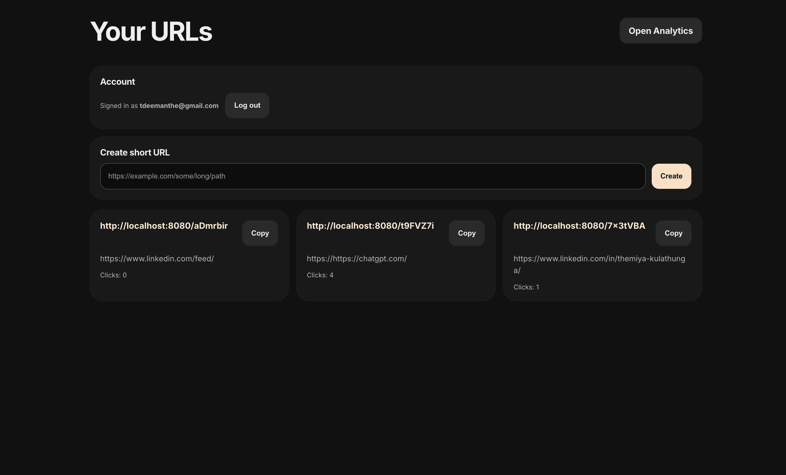
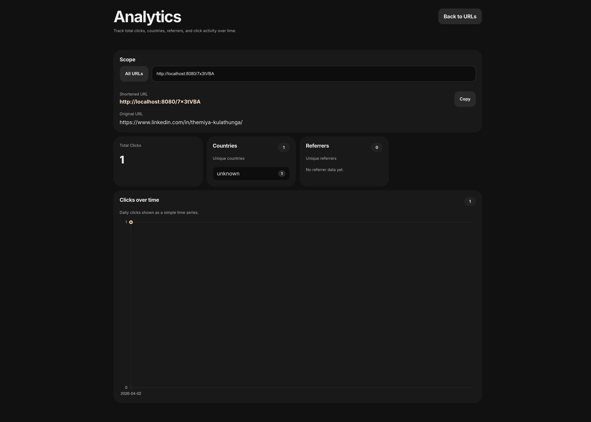

# URL Shortener

URL shortener built with Spring Boot, PostgreSQL and Redis.





### Overview
- Backend: Spring Boot 3 (Java 21)
- Persistence: PostgreSQL (Flyway migrations)
- Cache: Redis
- Build: Maven
- Container: Docker (Dockerfile + docker-compose)

### Features
- Create short slugs for long URLs
- Redirect to original URL with rate limiting and caching
- user ownership and anonymous limits for URLs
- Click event recording (geo/ip/referrals)
- Health and info endpoints (Actuator)

### Repository layout
- src/ - Java source code
- src/main/resources/db/migration - Flyway DB migrations
- Dockerfile - container image build
- docker-compose.yml - quick local environment (Postgres + Redis + app)
- infra/azure - Azure deployment manifests
- terraform - Terraform to provision Azure Services

# Quick start (development)

Prerequisites
- JDK 21
- Maven 3.9+
- Docker & Docker Compose

1) Clone the repository
```sh
   git clone [<this-repo-url>](https://github.com/tkuhemiya/url-shortener.git)
   cd url-shortener
```

2) Run with Docker Compose

- This will start Postgres, Redis and the app:
```sh
   docker-compose up --build
```

- App will be available at: http://localhost:8080
- Database defaults in application.yml:
  - DB: jdbc:postgresql://postgres:5432/url_shortener (user: postgres / password: postgres)
  - Redis: redis:6379

3) Run with Maven

- Build and run directly with Maven (this will require local Postgres/Redis or change envs to point to containers):
```sh
   mvn -q -DskipTests package
   java -jar target/url-shortener-0.0.1-SNAPSHOT.jar

   #or

   mvn spring-boot:run
```

## Environment configuration
- The application reads configuration from src/main/resources/application.yml.
- environment variables (examples):
  - DB_URL, DB_USER, DB_PASSWORD
  - REDIS_HOST, REDIS_PORT, REDIS_PASSWORD
  - SHORT_BASE_URL - base URL used when creating short links
  - CACHE_TTL_SECONDS - redis cache TTL for redirects

Example (overriding envs):
```sh
  SHORT_BASE_URL=http://localhost:8080 docker-compose up --build
```

## Database migrations
- Flyway is enabled and will run migrations from src/main/resources/db/migration on startup.
- Migrations create the initial links, click_events and users tables.

# Deployment / hosting
The project includes Azure-specific deployment scripts. 
- infra/azure/containerapp.yaml - Azure Container Apps manifest
- infra/azure/appservice.env.example - environment variables examples
- terraform/ - Terraform configuration to provision ACR + App Service and assign ACR pull role
